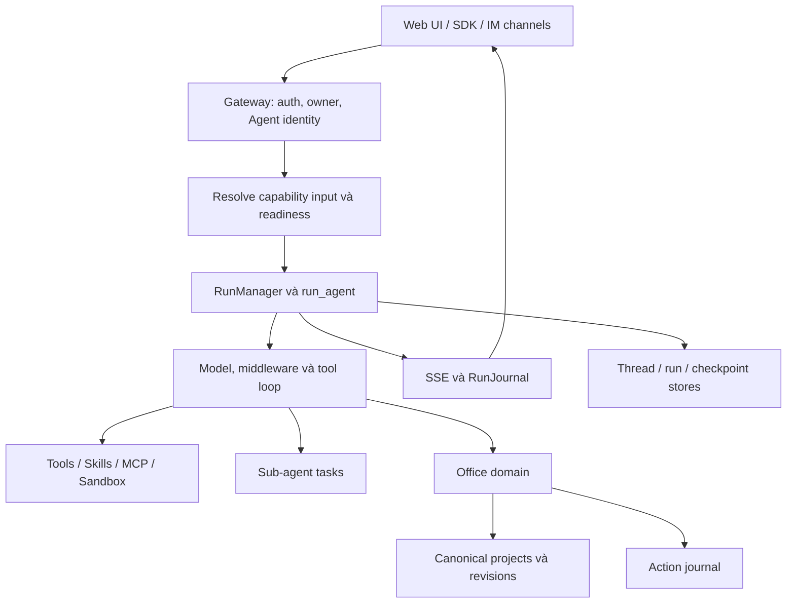

**Đánh giá dự án VassilFlow — 12/09/2026**

Đánh giá trên working tree hiện tại, gồm cả thay đổi chưa commit. Mục tiêu là hiểu kiến trúc, mức hoàn thiện và các điểm cần ưu tiên khi phát triển VassilFlow thành ứng dụng agent. Không sửa mã ứng dụng, không chạy tác vụ LLM thật hay thao tác lên dữ liệu người dùng. Báo cáo này là tài liệu mới được thêm trong lần rà soát.

**Nhận định chính:** VassilFlow đã có một agent harness dùng được làm nền tảng sản phẩm: runtime chung, công cụ, middleware, sub-agent, memory, sandbox, streaming và các agent chuyên biệt. Hướng kiến trúc hiện tại phù hợp với việc thêm agent theo lĩnh vực. Phần cần củng cố nhất là độ tin cậy của tác vụ dài, ngân sách thực thi, tính nhất quán của giao diện chat và giới hạn triển khai một tiến trình.

Đây là rà soát các luồng và module trọng tâm, không phải chứng nhận đã kiểm tra mọi dòng mã hay đánh giá bảo mật toàn diện. Các kết luận từ mã, tái hiện có giới hạn và kết quả test được phân biệt bên dưới.

**Bản đồ hệ thống.** Phiên bản trong package manifests là 2.1.0. Backend dùng Python >=3.12, FastAPI, LangChain/LangGraph, Pydantic, SQLAlchemy và Alembic. Frontend dùng Next.js 16, React 19, TypeScript, TanStack Query và LangGraph SDK; các con số này lấy từ manifests trong checkout, không phải thông tin phiên bản mới nhất trên mạng.

| Lớp | Vai trò | Điểm vào chính |
| --- | --- | --- |
| Frontend | Catalog agent, chat, upload, streaming, history, artifacts, Office workspace | `frontend/src/app/workspace/`, `frontend/src/components/workspace/` |
| Gateway | Auth, kiểm tra owner, chuẩn hóa yêu cầu, REST/SSE, khởi tạo run | `backend/app/gateway/app.py`, `services.py` |
| Harness | Model/tool loop, middleware, skills, memory, sub-agent, sandbox | `backend/packages/harness/vassilflow/` |
| Runtime | RunManager, worker, stream bridge, checkpoint, journal, lifecycle | `vassilflow/runtime/` |
| Agent/capability | Danh tính, policy, trusted input, readiness, phần mở rộng domain | `vassilflow/config/builtin_agents.py`, `vassilflow/capabilities/` |
| Domain Office | Tạo/kiểm tra/sửa/render tài liệu, project, revision, review, template | `vassilflow/community/office/` |
| Vận hành | Proxy, container, sandbox/provisioner, renderer, kiểm tra setup | `docker/`, `scripts/`, `Makefile` |

Nginx dùng cổng 2026; frontend dùng 3000; Gateway dùng 8001. `/api/langgraph/*` được proxy về API tương thích trong Gateway. Luồng triển khai mặc định không cần một LangGraph server riêng.



**Một yêu cầu agent đi qua hệ thống như thế nào.**

1. Frontend chọn `assistantId`, tạo hoặc mở thread, xử lý upload và gửi input cùng chế độ chạy. `ThreadChatPage` được dùng chung cho chat tổng và chat của agent.
2. Gateway lấy user từ auth context, kiểm tra quyền truy cập thread, chuẩn hóa danh tính agent và từ chối các bản sao danh tính mâu thuẫn trong request.
3. Capability input từ trình duyệt được adapter phía server resolve lại. Office selection phải khớp owner, revision, hash, object path và fingerprint.
4. Runtime kiểm tra readiness trước khi tạo run, gắn agent vào thread rồi gọi `RunManager.create_or_reject()`.
5. `run_agent()` thiết lập journal, runtime context, checkpoint/store, xây agent và chạy `agent.astream()`.
6. Model gọi công cụ qua chuỗi middleware. Event được phát qua stream bridge; journal lưu lịch sử và thông tin quan sát thực thi.
7. Worker hoàn tất trạng thái run/thread và lưu thông tin liên quan. Thay đổi Office có bằng chứng riêng trong domain và Action journal; run thành công không tự chứng minh mọi mutation đã thành công.

Nguồn chính: `backend/app/gateway/services.py:679`, `backend/packages/harness/vassilflow/runtime/runs/worker.py:124`, `frontend/src/components/workspace/chats/thread-chat-page.tsx:192`.

**Ba khái niệm agent cần phân biệt khi phát triển sản phẩm.**

| Khái niệm | Đã triển khai | Ý nghĩa |
| --- | --- | --- |
| Agent mặc định | `lead_agent` | Agent tổng quát dùng model, tools và middleware theo config |
| Agent cá nhân / built-in | `AgentConfig` + `SOUL.md`, hoặc `BuiltinAgentDefinition` | Sản phẩm chuyên biệt dùng chung runtime; khác prompt, model, tools, skills và policy |
| Sub-agent | `SubagentExecutor`, công cụ `task` | Tác vụ được lead agent giao trong một run; có context riêng và trả kết quả về |

Personal agent được lưu theo user, có `name`, `description`, `model`, `tool_groups`, `skills` và nội dung `SOUL.md`. Built-in registry hiện khai báo Office là agent chuyên biệt; các category trong catalog không đồng nghĩa mỗi category đã có một built-in agent.

Sub-agent nhận prompt riêng và trả kết quả về lead, dùng cùng phạm vi workspace/sandbox được cấp và kế thừa policy. Công cụ `task` bị loại khỏi tác vụ con để tránh delegation đệ quy. Cơ chế hiện tại phù hợp phân công một tầng; chưa có team mailbox và giao việc tiếp cho một worker đã hoàn thành.

Memory dài hạn hiện là quá trình trích xuất facts/preferences vào JSON theo user/agent, có debounce, lọc confidence và xử lý correction/reinforcement. Nó khác với checkpoint hội thoại và chưa phải kho vector retrieval/RAG. Queue cập nhật memory nằm trong RAM, nên checkpoint đã lưu không bảo đảm extraction đang chờ sẽ tồn tại qua crash.

UI ánh xạ chế độ thành các cờ: flash tắt thinking; pro/ultra bật planning; ultra bật sub-agent. Policy vẫn quyết định công cụ thực sự có được phép chạy hay không. Office hiện không cho phép `task`, nên bật chế độ ultra không tự cấp quyền điều phối sub-agent cho Office.

Nguồn: `config/agents_config.py:39`, `config/builtin_agents.py:125`, `frontend/src/core/threads/hooks.ts:1265`.

**Những phần nền tảng đã làm tốt.**

- Ranh giới `app -> harness` rõ, có test chặn harness import ngược `app.*` và test chặn domain Office quay lại các module runtime tổng quát.
- Policy do server sở hữu, lọc tool schema và kiểm tra lại trước thực thi; sub-agent kế thừa policy. Đây là kiểm soát bằng mã, không chỉ dựa vào lời nhắc cho model.
- Middleware đã xử lý nhiều tình huống thực tế: thiếu tool result sau interruption, lỗi LLM/tool, output quá lớn, vòng lặp, read-before-write, usage, summarization và human input.
- MCP có discovery và cơ chế chỉ đưa schema công cụ vào context khi cần. Skills có whitelist, slash activation và discovery riêng.
- Sandbox có abstraction thống nhất. Local provider ánh xạ workspace theo thread; AIO cung cấp môi trường container. Cần hiểu đúng rằng bật host bash ở LocalSandbox không tạo ranh giới cô lập tương đương container.
- Có checkpoint, lịch sử run, token accounting, workspace changes và tích hợp tracing. Có public Python factory và embedded client ngoài giao diện web.
- Frontend đã có optimistic messages, reconnect, regenerate, branch, human input và xem artifacts. Office dùng extension registry và chat shell chung.
- CI đã khai báo unit tests, E2E, replay giữa frontend/backend và kiểm tra blocking I/O. Việc CI có workflow chưa đồng nghĩa mọi workflow đã được chạy trong lần rà soát này.

**Office và các thay đổi kiến trúc đang làm.**

Các file mới về `actions`, `capabilities`, repository và thread lifecycle cho thấy dự án đang chuyển phần tích hợp Office sang hợp đồng dùng chung. Một số nhận xét trong audit ngày 23/07 phản ánh trạng thái trước thay đổi; không nên dùng nguyên kết luận cũ để mô tả working tree hiện tại.

`AgentCapabilityAdapter` đóng góp resolve input, middleware, readiness và project repositories. Office có source/result hash, revisions bất biến, receipts mô tả thay đổi, render evidence, review và final selection. Restore tạo revision mới. File trong workspace chat là bản materialize; canonical artifact nằm ở project repository.

Thread lifecycle nối hai phía: xóa chat tách liên kết nhưng giữ project; branch có quy tắc clone liên kết và bản làm việc. Action journal ghi nguồn gốc mutation từ cả tool lẫn API, có lease và reconciliation. Đây là nền tảng hữu ích cho agent tạo ra sản phẩm bền vững ngoài hội thoại.

Việc lắp domain mới vẫn cần cập nhật composition root cho lifecycle/reconciliation (`app/gateway/domain_lifecycle.py`, `domain_repair.py`). Đó là bước tích hợp rõ ràng hiện nay; chưa phải cơ chế plugin tự đăng ký mọi thành phần chỉ từ một manifest.

**Các lỗi và khoảng trống đã xác định, theo mức ưu tiên đề xuất.**

1. **Ưu tiên cao: callback memory có thể liên tục tạo `Timer(0)`.** Tại `agents/memory/queue.py:218`, nếu `_processing` đang true thì callback lại gọi `_schedule_timer(0)`. Callback tiếp theo vẫn gặp cùng điều kiện cho đến khi worker hoàn tất. Đã tái hiện bằng các method lấy từ AST của source và FakeTimer: 101 callback tạo 101 timer không độ trễ, còn một callback chờ tiếp, ngay cả khi queue rỗng. Không tạo thread thật trong tái hiện. Hậu quả có thể là churn thread/CPU trong thời gian chờ cập nhật memory. Nên dùng một worker với tín hiệu có việc chờ, hoặc lên lịch lại có kiểm soát sau khi lượt hiện tại hoàn thành. Unit tests hiện tại vẫn qua vì chưa khóa tình huống callback lặp này.

2. **Ưu tiên cao trước khi mở rộng triển khai: startup gate cho phép cấu hình vượt khả năng runtime.** `app/gateway/deps.py:50` cho phép nhiều worker nếu DB là PostgreSQL; test `test_multi_worker_postgres_gate.py:36` cũng xác nhận hành vi đó. Trong khi đó RunManager/stream vẫn process-local và Redis bridge tại `runtime/stream_bridge/async_provider.py:52` chưa triển khai. Tài liệu đúng khi yêu cầu một worker, nhưng guard và thông báo lỗi có thể khiến người vận hành hiểu rằng đổi DB là đủ. Nên cưỡng chế topology được hỗ trợ hoặc kiểm tra đồng thời run coordinator, stream và repository concurrency. Chưa chạy mô phỏng tải nhiều worker; đây là bất nhất được xác minh từ mã và hợp đồng triển khai.

3. **Ưu tiên vừa: cursor danh sách chat bị mất khi map/filter cache.** `frontend/src/core/threads/hooks.ts:1693` lưu next offset bằng Symbol trên mảng; helper tại `:1782` và `:1795` tạo mảng mới làm mất metadata. Tái hiện bằng helper thật được transpile trong bộ nhớ: raw `[sidecar,a,b]` cho visible `[a,b]`, cursor đúng `3`; qua map trở thành `2`, qua filter có thể thành `undefined`. Có thể tải trùng hoặc dừng phân trang; refetch sau delete đôi khi che lỗi. Nên dùng page object có `items` và `nextOffset`, cùng test tổ hợp fetch -> cập nhật cache -> fetch tiếp.

4. **Ưu tiên vừa: lỗi tải lịch sử không tới UI.** Tại `frontend/src/core/threads/hooks.ts:1557`, code không kiểm tra HTTP status trước khi đọc JSON. `catch` tại `:1607` chỉ ghi console, nên caller không nhận lỗi để hiện toast. Khi API lỗi, người dùng có thể thấy hội thoại thiếu phần cũ mà không có giải thích. Nên đưa error state/retry vào luồng history hoặc throw lại sau cleanup. Kết luận từ mã; chưa tái hiện bằng trình duyệt với backend 5xx.

5. **Ưu tiên vừa nếu dùng frontend/backend khác origin: SDK không gửi kèm session cookie.** README frontend cho phép URL Gateway riêng. REST fetcher đặt `credentials: "include"`, nhưng `createCompatibleClient()` tại `frontend/src/core/api/api-client.ts:156` chỉ inject CSRF và assistant binding; SDK được cài cũng không thêm credentials. Fetch mặc định không gửi cookie sang origin khác. Cần chuẩn hóa option này và test cấu hình split-origin. Proxy cùng origin mặc định không chịu vấn đề này. Chưa xác minh bằng browser integration trong lần này.

6. **Khoảng trống cho agent chạy dài: sub-agent chưa có kiểm soát context/token tương đương lead.** `subagents/executor.py:428` đọc và inject nội dung các skill được phép; khi không đặt whitelist riêng, tập skill có thể rộng. Chuỗi middleware sub-agent tại `agents/middlewares/tool_error_handling_middleware.py:278` có loop/safety guard nhưng chưa có summarization và TokenBudgetMiddleware như lead. Usage có thể cộng về lead sau tác vụ, nhưng không phải hạn mức trực tiếp trong lúc sub-agent đang chạy. Nên cấp ngân sách con, whitelist skill theo nhiệm vụ, cân nhắc nạp skill theo nhu cầu. Phạm vi nhận xét là agent có quyền dùng `task`; Office hiện không có quyền này.

7. **Lỗi test isolation: model thử nghiệm làm bẩn global metadata.** `backend/tests/test_persistence_scaffold.py:283` khai báo `_Tmp(Base)` với table `_tmp_test` nhưng không gỡ khỏi `Base.metadata`. Chạy sau đó schema parity test tại `test_persistence_bootstrap.py:495` sẽ fail vì table không thuộc migration. Đã tái hiện bằng đúng hai test theo thứ tự này; chạy bootstrap riêng qua. Nên dùng Base riêng cho test hoặc cleanup metadata. Đây là lỗi bộ kiểm thử, chưa phải bằng chứng lỗi migration ở production.

**Các giới hạn cần tính vào thiết kế sản phẩm.**

- Sub-agent hiện là tác vụ có context riêng, không có checkpointer để resume (`executor.py:425`); scheduler dùng pool ba worker. Không nên diễn giải thành hệ thống worker phân tán hoặc mọi sub-agent có thể tự tiếp tục sau restart.
- Giới hạn sub-agent ở runtime có thể khác pool ba worker dùng chung toàn process. Deadline phía task tool tính từ lúc submit, nên thời gian chờ hàng đợi cũng ảnh hưởng tác vụ khi nhiều user/thread chạy đồng thời.
- Run đang chạy khi Gateway SQLite khởi động lại được đánh dấu error qua recovery. Có checkpoint không đồng nghĩa tác vụ đang chạy được tự động tiếp tục.
- Application DB và file repositories là hai lớp lưu trữ. PostgreSQL không chuyển Action, lifecycle, Office và workspace thành storage nhiều writer. Backup nhất quán cần dừng ghi và lấy cả DB lẫn runtime root; xem `docs/PERSISTENCE.md:30` và `:45`.
- Không có transaction chung giữa run/checkpoint, thread files, Action và domain project. Recovery cần dựa vào journal, idempotency và bằng chứng canonical.
- Readiness có cache và probe timeout; trạng thái ready/degraded không thay thế kiểm tra quyền, toàn vẹn revision và khả năng thực hiện từng operation.
- API assistants tương thích phục vụ SDK, nhưng graph/schema introspection trả cấu trúc tối thiểu. Đây chưa phải toàn bộ LangGraph Platform.
- Một số tài liệu lệch mã: frontend AGENTS nhắc `usePoseStream.ts`/`App.tsx`; README còn route `/chats`; backend CLAUDE có phần đếm middleware cũ. Khi tra cứu nên ưu tiên source và `backend/docs/ARCHITECTURE.md` hiện tại.

Cấu hình local được đọc trong lần rà soát bật token usage nhưng tắt token budget; dùng LocalSandboxProvider với `allow_host_bash: true`, và bật memory. Đây là trạng thái cấu hình phát triển hiện tại, không phải mặc định bắt buộc của harness. Vì vậy không nên coi việc đã có middleware budget trong source là ngân sách đang được cưỡng chế trên máy này.

**Kiểm tra đã thực hiện.** Chạy bằng dependency sẵn có, không cài thêm. Các dòng là từng nhóm kiểm tra, không cộng lượt chạy lại thành số test độc lập.

| Nhóm | Kết quả |
| --- | --- |
| Frontend `pnpm typecheck` | Qua |
| Frontend `pnpm test` | 56 file, 485 test qua, không skip |
| Backend Gateway/run/stream/auth/boundary/journal | 337 qua, 2 cảnh báo deprecation |
| Backend Action/repository/lifecycle/readiness/materialization/boundary | 68 qua, 3 skip, 1 cảnh báo |
| Backend memory queue và sub-agent executor | 75 qua |
| Backend Office/project/template/selection/repair/persistence | 164 qua, 1 fail do test isolation nêu trên |
| Chạy riêng bootstrap và regression | 24 qua |
| Tái hiện tối thiểu test isolation | 1 qua, 1 fail, đúng `_tmp_test` |

Ba skip thuộc kiểm tra symlink/directory link không thực hiện được trong môi trường Windows này. Chưa chạy toàn bộ backend suite, full-stack E2E, LLM thật, PostgreSQL thật, renderer live hoặc load test. Vì vậy kết quả trên xác nhận các hợp đồng đã kiểm tra, chưa đo chất lượng hoàn thành nhiệm vụ hay hiệu năng vận hành.

Các lệnh backend chính, chạy từ `backend` bằng `.venv\Scripts\python.exe -m pytest`:

```powershell
.venv\Scripts\python.exe -m pytest tests/test_gateway_services.py tests/test_run_manager.py tests/test_run_worker_rollback.py tests/test_stateless_runs_owner_isolation.py tests/test_auth_middleware.py tests/test_harness_boundary.py tests/test_agent_frontend_contract.py tests/test_run_journal.py tests/test_gateway_run_recovery.py tests/test_gateway_run_drain_shutdown.py tests/test_stream_bridge.py -q --tb=short

.venv\Scripts\python.exe -m pytest tests/test_action_store.py tests/test_actions_router.py tests/test_action_provenance.py tests/test_action_reconciliation.py tests/test_project_repository.py tests/test_thread_lifecycle.py tests/test_capability_readiness.py tests/test_agent_runtime_readiness.py tests/test_gateway_readiness.py tests/test_office_materialization.py tests/test_package_import_boundaries.py -q --disable-warnings

.venv\Scripts\python.exe -m pytest tests/test_memory_queue.py tests/test_subagent_executor.py -q --disable-warnings

.venv\Scripts\python.exe -m pytest tests/test_office_projects_router.py tests/test_office_templates_router.py tests/test_office_revisions.py tests/test_office_selection.py tests/test_office_run_selection.py tests/test_office_selection_approval_middleware.py tests/test_office_selection_context_middleware.py tests/test_office_project_workflow.py tests/test_office_tools.py tests/test_projection_repair.py tests/test_persistence_scaffold.py tests/test_persistence_bootstrap.py tests/test_persistence_bootstrap_regression.py -q --disable-warnings

.venv\Scripts\python.exe -m pytest tests/test_persistence_scaffold.py::TestBaseToDictMixin::test_to_dict_and_exclude tests/test_persistence_bootstrap.py::test_create_all_and_alembic_upgrade_produce_same_schema -q --disable-warnings
```

**Thứ tự phát triển tôi đề xuất từ mã hiện tại.**

1. Sửa memory timer, cursor cache, history error, SDK credentials và test isolation; bổ sung regression tập trung vào tình huống thực tế.
2. Chốt hợp đồng vận hành một worker, recovery sau crash và backup/restore cho cả DB lẫn filesystem. Khóa cấu hình không được hỗ trợ ngay khi startup.
3. Củng cố agent chạy dài: ngân sách token/thời gian cho tác vụ con, chính sách nạp skill, cancel/timeout nhất quán và hiển thị rõ kết quả chưa hoàn tất.
4. Xây bộ đánh giá nhiệm vụ mẫu có tiêu chí đầu ra: tỷ lệ hoàn thành, tính đúng artifact, số lần cần người dùng can thiệp, token, thời gian và khả năng phục hồi. Replay kiểm tra hợp đồng giao tiếp; đánh giá nhiệm vụ thật mới cho biết agent làm việc tốt đến đâu.
5. Thêm một domain agent thứ hai theo capability contract hiện có để kiểm chứng khả năng tái sử dụng. Giữ schema nghiệp vụ trong domain và dùng chung run/stream/chat; chỉ tổng quát hóa phần mà hai domain thực sự dùng chung.
6. Sau khi ổn định hành vi, tách `frontend/src/core/threads/hooks.ts` thành streaming, history, pagination và mutations để giảm chi phí thay đổi.

**Các file nên dùng làm điểm vào khi tiếp tục làm việc:** `backend/app/gateway/services.py`, `backend/packages/harness/vassilflow/agents/lead_agent/agent.py`, `backend/packages/harness/vassilflow/config/builtin_agents.py`, `backend/packages/harness/vassilflow/capabilities/adapter.py`, `backend/packages/harness/vassilflow/runtime/runs/worker.py`, `frontend/src/components/workspace/chats/thread-chat-page.tsx` và `frontend/src/core/threads/hooks.ts`.
